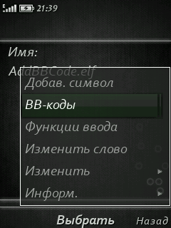
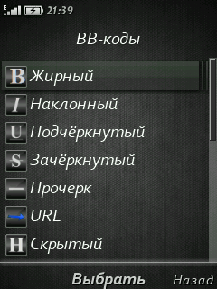
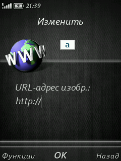
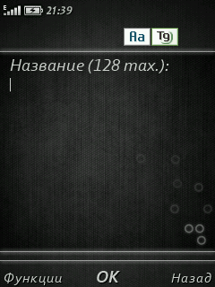
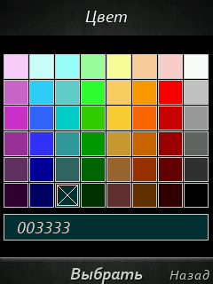
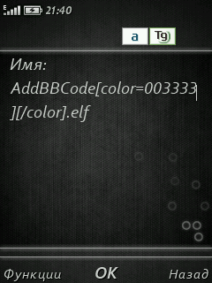
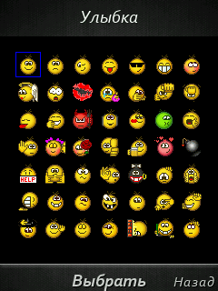

### Репозиторий моих elf'ов для телефонов Sony Ericsson.

Узнать подробнее об Elf'ах и ElfPack'е можно на форумах:
* [mobilefree.ru/supertrubka.org](https://mobilefree.justdanpo.ru/)
* [SEclub.org](https://seclub.org/forum/topics/76/)
* 
* Для запуска эльфов требуется установленный ElfPack ([github.com/justdanpo/elfpack-se/tree/master/ElfPack](https://github.com/justdanpo/elfpack-se/tree/master/ElfPack/)).
* Для компиляции эльфов требуется установленный [IAR EW 4.4.2](/IAR_EW_4.4.2.A.rar), а также наличие в папке проектов папки ["include"](/include).
* Для конвертации элфпака в патч нужен [elf2vkp](/elf2vkp.rar).
* Примеры эльфов и необходимые для функционала эльфы (такие как BookManager и BcfgEdit) брать в репозитории [тут](https://github.com/justdanpo/elfpack-se).

#### AddBBCode v1.1fix [[Тема  на mobilefree]](https://mobilefree.justdanpo.ru/newbb_plus/viewtopic.php?topic_id=5591)
* эльф для добавления BB-кодов и смайлов в текстовое поле при написании сообщений на форуме и т.д.
* в bcfg-конфиге указываем названия книг и (или) ява-приложений, в которые будет добавляться софт открытия главного меню эльфа;
* возможно управление с клавиатуры (дублирует джой/навикей);
* вставка осуществляется в положение курсора, сам курсор устанавливается между тегами, если имеется закрывающий.
* русский и английские варианты
* ресурсы класть в "/Config/AddBBCode" (рекомендуется установка .pkg, есть в релизах)

<!-- SKREENSHOOTS -->

  
Скриншоты

  

    
  

  

    
  

  

    
  

  

    
  

  

    
  

  

    
  

  

    
  

#### AllInfo v.1.0
* Эльф показывает кучу всякой информации о телефоне и состоянии.

#### CameraEverywhere v.1.2
* Эльф запускает камеру, где бы вы не находились-хоть в дф, хоть в яве..одним словом отовсюду. Имеется конфиг, в нём настройка одновременно до 3-х кнопок активации и параметры вибрации.

#### DisableGameA&B v.1.0
* Эльф отключает стандартное действие кнопок Игра А и Игра Б на Standby у телефонов имеющих эти кнопки (k790/k800). В камере работают как обычно, не работают при залоченой клаве.

####  ElfsGlue v1.1
* Эльф для запуска других эльфов. Есть bcfg-конфиг. Всего можно запустить до 15 эльфов за раз.  Есть возможность отключить загрузку. Аналог эльфа на Siemens.

#### LongLock v1.0fix
* Блокировка клавы на "#". Работает на стенбае, в плеере/радио. Рекомендуется установить патч: "отключить блокировку клавиатуры на "*" + "правый софт". Удобно, + закос под сименс. Пофиксил блокировку при запущеном плеере/радио где угодно.

#### iconattach
* Порт IconAttach elf (c)Tartes for PC на ElfPack. Добавляет иконки к эльфу.

#### Key2Joy
* Позволяет дублировать нажатия джойстика на клавишах 2, 4. 6, 8, 5.

#### KeysLocker
* Смена кнопок блокировки. Есть bcfg-конфиг. 

#### PictureSwitch
* Возможность листать навикеем фото/видео не только вправо-влево, но и вверх-вниз.

#### QuickAccess
* Изменённое меню быстрого доступа по долгому нажатию кнопки выключения.

#### Read-Write_PNG
* Чтение/запись *.png файла с помощью pnglib.dll.

####  ReadWriteBMP
* Чтение/запись *.bmp файла.

#### Restart v1.2
* Перезагружает телефон по нажатию кнопки. Есть bcfg-конфиг, в нём настройка кнопки и параметры вибрации. Не работает при залоченой клаве.
